# Multi-Agent System — Reply Project
**Team members:**

-Nicola Campaniello (nicola.campaniello@studenti.luiss.it)

-Andrea Cappelluti (a.cappelluti@studenti.luiss.it)

-Filippo Cesari (filippo.cesari@studenti.luiss.it)


## Section 1 – Introduction

Our project explores the architecture, development, and deployment of a multi-agent AI system that transforms user-provided natural language questions into accurate Python-based data analysis and visualizations. The system is particularly tailored for interacting with structured public administration datasets and was developed as part of a collaborative innovation project.

The central challenge we tackled was how to convert ambiguous or general user prompts into context-aware, reliable, and reproducible data-driven outputs. Rather than relying on traditional hard-coded logic or static queries, we opted for a modular, dynamic approach by building a system of agents using OpenAI's cutting-edge Agent SDK (v4.1).

Initially, our project started with a more static structure: manually routed prompts, long handcrafted queries, and a system of isolated agents and tools. However, as development progressed, we transformed this structure into a streamlined pipeline that improves interpretability, reduces token usage, and enhances response accuracy. Key milestones included the integration of semantic parsers, memory modules, and a dynamic prompt system derived from OpenAI's own guidelines.

The final system includes a unified chat interface built in Streamlit, three main datasets, a pipeline of reasoning agents, and custom-built logic for execution and memory. This makes the system suitable for both civic use cases and research into AI-human collaboration.

## Section 2 – Methods

**2.1 Data Analysis & Preprocessing**

We began with extensive EDA across all four datasets to assess quality, structure, and completeness. Common issues included inconsistent column types (e.g., numeric fields stored as strings) and heterogeneous Italian column names. We performed:
•	Column-type normalization (stripping textual noise, converting to numeric)
•	English translation of column names for cross-dataset consistency
•	Shared-column alignment (gender, region, age_min/age_max, administration)

These preprocessing steps enabled robust, automated code generation and seamless agent reasoning.

**2.2 System Architecture**

Our goal was to build a single, dynamic pipeline that can interpret a user’s natural‐language query, select the appropriate dataset, generate both textual and visual outputs, and maintain conversational context over time. 
Early iterations used two separate agents (one for report generation, one for image generation), but this introduced unnecessary overhead and static behaviors. After upgrading to the GPT-4.1 model and adopting a structured “system prompt + toolchain” approach, we consolidated into a single pipeline that:

1.	Parses the user’s query using a document‐parser (Llama-Index) to identify intent and map keywords to one of four CSV datasets.
2.	Selects, loads and generate python code of the corresponding dataset (e.g., EntryAccessoAmministrati_202501.csv).
3.	Invokes the Python executor tool to run on-the-fly analysis with pandas and matplotlib, returning tables, charts, or summary statistics.
4.	Generates narrative output via GPT-4.1, weaving in the computed results.
5.	Stores memory of previous queries and key facts in a Redis‐backed memory module, so follow‐up questions can be succinctly answered.


**2.3 Core Components and Algorithms**

•	Document Parser: We evaluated Hugging Face sentence-transformers but ultimately adopted Llama-Index for its tight integration with our JSON‐based toolchain. This parser transforms each incoming query into an embedding, matches it against dataset‐specific “intents,” and routes the query accordingly.

•	Toolchain:

o	Data Processor: Understand the user query leveraging Llama index and return a prompt formatted in json.

o	Generate Python code: Generate code for report and visualization in order to be runned by the next tool.

o	Python Executor: Dynamically executes pandas scripts to compute summary tables, group‐bys, time‐series plots, and custom metrics.(**the only tool built entirely with GenAi**)

•	Language Model: Leveraging OpenAI’s GPT-4.1 via the Agent SDK, we crafted a system prompt with explicit instructions:
1.	How to format data output (e.g., “If you call the Python executor, return JSON with keys code).
2.	Guidelines for narrative style (concise, Italian/English bilingual support).
•	Memory Module: it stores 6 “memory snippets” per conversation, including dataset context.


**2.4 Environment Setup and Reproducibility**

The repository is organized as follows:

- **`main.py`**: Defines all agents, toolchains, datasets, memory logic, and OpenAI model configurations. This file is the computational backend.
- **`app.py`**: The frontend Streamlit script. Handles chat layout, query input, response rendering, and interactive visual outputs.
- **`requirements.txt`**: Lists all necessary libraries, including:

- **Datasets**:
  - `EntryAccessoAmministrati_202501.csv`
  - `EntryAccreditoStipendi_202501.csv`
  - `EntryAmministratiPerFasciaDiReddito_202501.csv`
  - `EntryPendolarismo_202501.csv`

- **`images/`**: Contains screenshots and visual outputs used for reporting and presentation.
- **`Reply NoIpa Logo.png`**: Custom logo designed for the app.
- **`Replyppt.pdf`**: PowerPoint summarizing the project architecture and findings.

---

**Installation & Execution**

1. **Clone the Repository**
```bash
git clone https://github.com/nicogstar/Multi-Agent-System-Reply803881.git
cd reply-multi-agent
```

2. **Create a Virtual Environment**
```bash
python -m venv .venv
source .venv/bin/activate  
```

3. **Install Dependencies**
```bash
pip install -r requirements.txt
```

4. **Insert Your OpenAI API Key**
Edit `main.py`:
```python
openai_api_key = "sk-..."
os.environ["OPENAI_API_KEY"] = openai_api_key
```

5. **Launch Streamlit App**
```bash
streamlit run app.py
```

This will open a browser interface where you can interact with the agents.

## Section 3 - Experimental Design


**3.1 Static Logic & Isolated Tools**

Main Purpose:
Validate the feasibility of a keyword-driven routing system that maps user prompts to predefined Python snippets.

Description:
In this initial setup, we built a monolithic controller using extensive if/else statements to inspect incoming user queries for specific keywords (e.g., “plot,” “summarize,” “filter”). When a match was found, the corresponding hard-coded Python function executed against our sample dataset. This design enforced a rigid mapping: any deviation in phrasing led to failed or incorrect tool invocations. We also maintained two standalone scripts—one for report generation and one for image rendering—each triggered by explicit keywords. This phase exposed the brittleness of purely syntactic matching and informed the need for a more flexible interpretation layer.

**3.2 Semantic Parsing with SentenceTransformer (all-MiniLM-L6-v2)**

Main Purpose:
Demonstrate that embedding-based intent detection can handle paraphrased or context-rich queries more flexibly than keyword matching.

Description:
To overcome the limitations of static keyword checks, we integrated the all-MiniLM-L6-v2 model from Hugging Face. Each user query was encoded into a 384-dimensional embedding and compared via cosine similarity against embeddings of our available tool descriptions and data fields. This allowed us to group semantically similar requests—e.g., “show me a bar chart of sales” and “visualize revenue by category”—even when they shared no common tokens. We dynamically retrieved relevant columns by selecting the highest-similarity field embeddings, rather than relying on exact names. This phase improved adaptability to varied language but revealed performance bottlenecks when scaling to thousands of documents and highlighted the need for structured orchestration.

**3.3 Composable Pipeline with LlamaIndex & Agent SDK 4.1**

Main Purpose:
Integrate intent parsing, code generation, execution, and memory into a unified, modular framework for end-to-end query handling.

Description:
Building on semantic parsing, we adopted LlamaIndex to structure our data connectors and OpenAI’s Agent SDK 4.1 to orchestrate the workflow. The pipeline comprises four interchangeable components:

Intent Parser: Translates user goals into discrete subtasks (e.g., “load data,” “filter rows,” “plot results”).
Code Generator Agent: Crafts context-aware Python code based on parsed subtasks and available data schemas.
Python Executor: Safely runs generated code in an isolated environment, capturing outputs and errors.
Memory Module: Stores recent interactions, allowing agents to reference past queries (e.g., remembering which dataset the user last loaded).
This modular approach enabled parallel processing of subtasks and simplified the addition of new connectors (e.g., SQL, REST API) by adhering to a common interface. We observed a substantial reduction in surprise errors and friction when extending functionality, validating the power of composability.

## Section 4 - Main Finding & Results

**4.1 Main Finding**

This project offered valuable insights across both technical and collaborative dimensions. Here are the key lessons we gained through the development and evaluation of our multi-agent system:

1. Prompt Design Is Everything
We learned that the way we structure prompts drastically affects the quality of responses from language models. Early vague or overly long prompts often led to hallucinated or irrelevant outputs. Only when we formalized a clear, instruction-based prompt system (inspired by OpenAI’s own SDK documentation) did the system become consistently reliable and accurate.

2. Less Architecture, More Flow
Our initial architecture had too many redundant agents and unnecessary complexity. Simplifying it into a pipeline with one main reasoning path—where each stage feeds the next—made the system faster, more interpretable, and less prone to bugs. We discovered that thoughtful orchestration and tool reuse are more effective than having multiple isolated agents.

3. Semantic Tools Amplify Intelligence
The integration of tools like LlamaIndex allowed us to understand the user’s query in a more context-aware way. It helped the system choose the right dataset and identify relevant variables without relying on rigid keyword matching. This step dramatically improved both usability and output quality.

4. LLMs Are Powerful But Still Need Structure
We experienced firsthand how raw model outputs can be misleading or incomplete if not guided properly. Language models don’t “understand” context unless we build it into memory, prompts, or pre/post-processing logic. This reinforced the importance of combining LLMs with deterministic logic and domain rules.

5. Evaluation Requires Human + Machine
Evaluating outputs wasn’t straightforward.There’s no one-size-fits-all solution yet for evaluating agent-generated analytics.

6. Collaboration and Iteration Matter
The success of the system wasn’t the result of a single idea, but constant iteration, team feedback, and real-time testing. From switching transformer models to redesigning the interface and agents, each major improvement was the result of collaborative experimentation.

**4.2 Results**

**Evaluation Query**

1.**Calculates the percentage distribution of access methods to the NoiPA portal among users aged 18-30 compared to those over 50, broken down by region of residence**

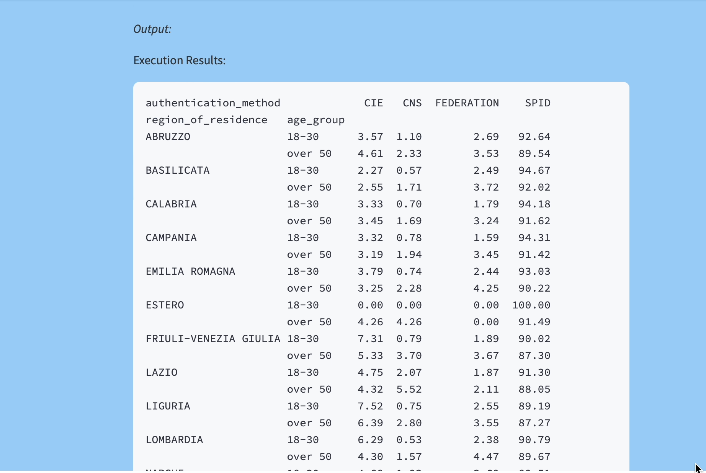
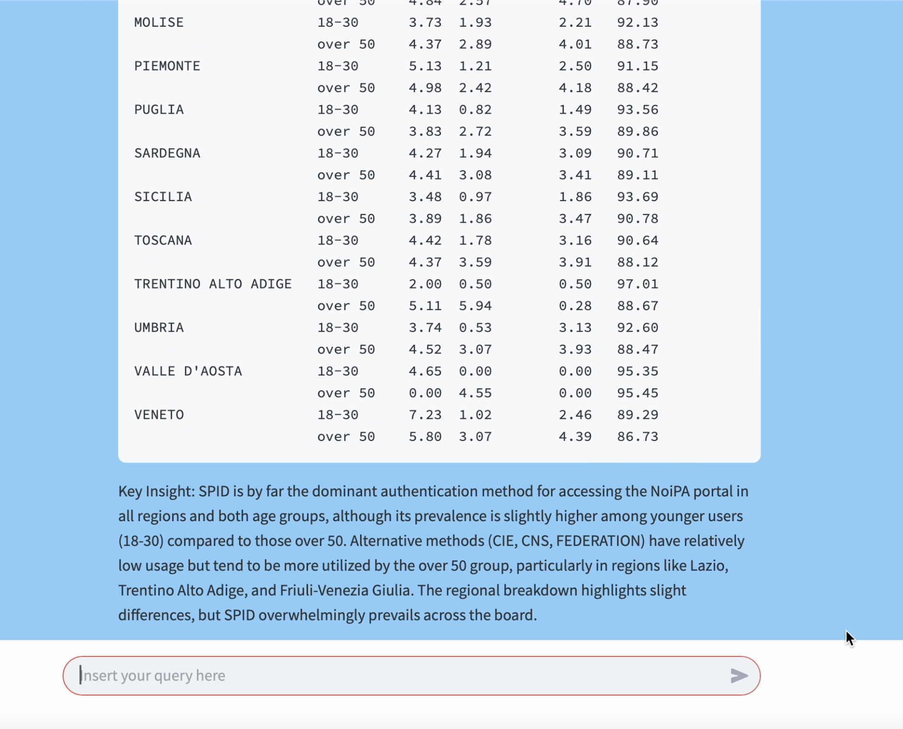


2.**Identifies the most used payment method for each age group and generates a graph showing whether there are correlations between gender and payment method preference**
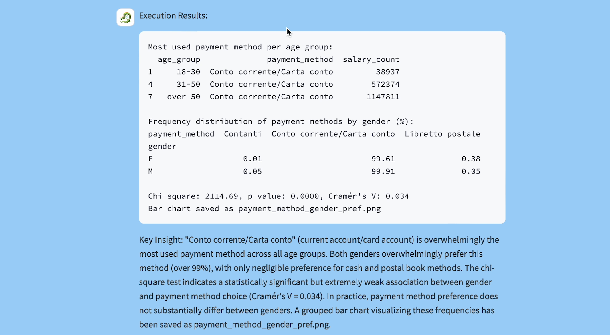
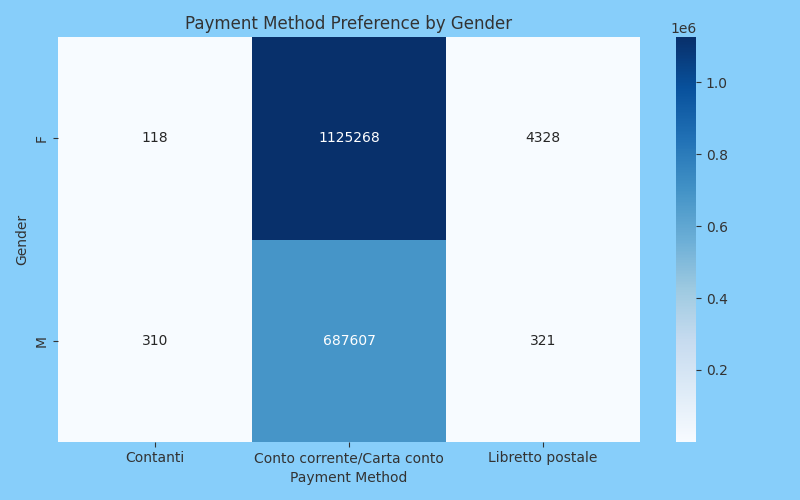


3.**Analyzes commuting data to identify which administrations have the highest percentage of employees who travel more than 20 miles to work**
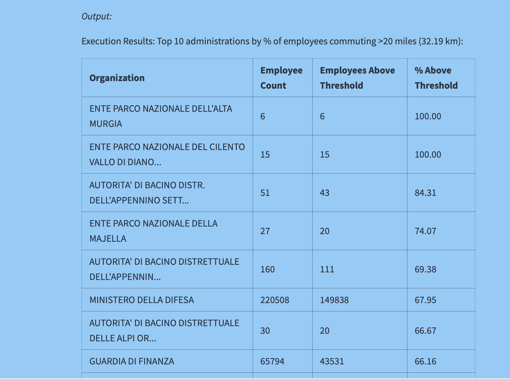
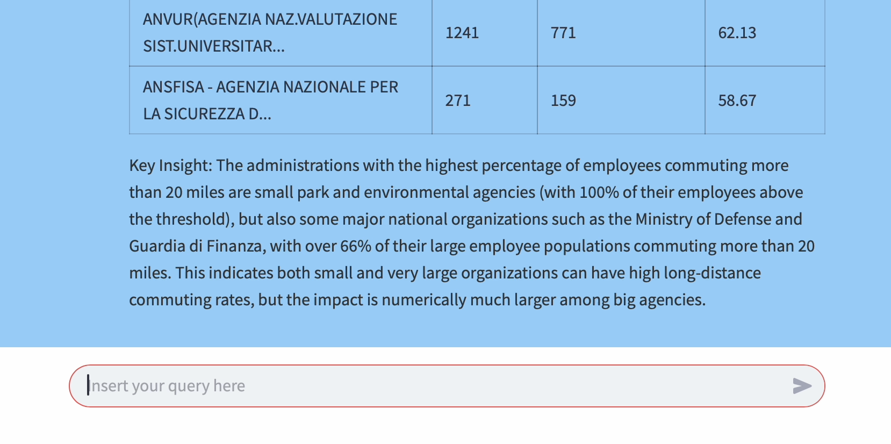


4.**Compares the gender distribution of staff among the five municipalities with the largest number of employees, highlighting any significant differences in representation by age group**


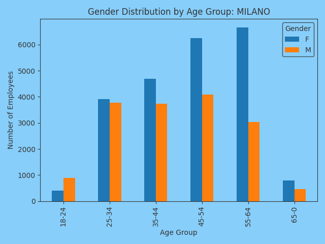
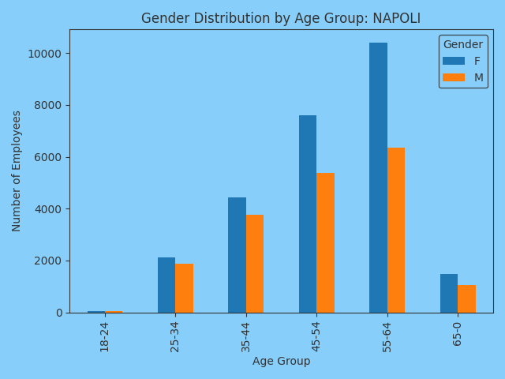
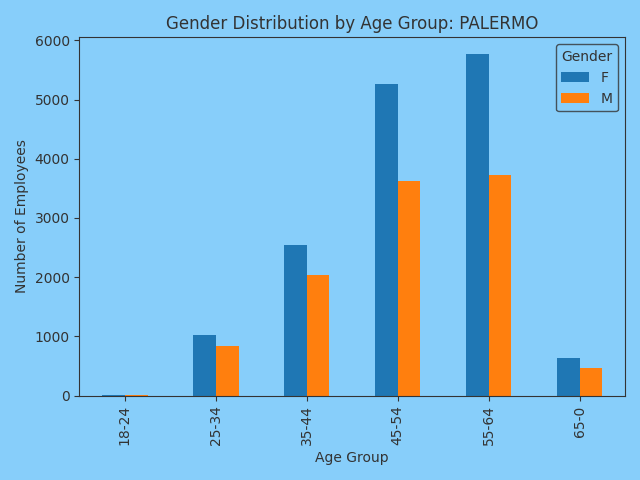
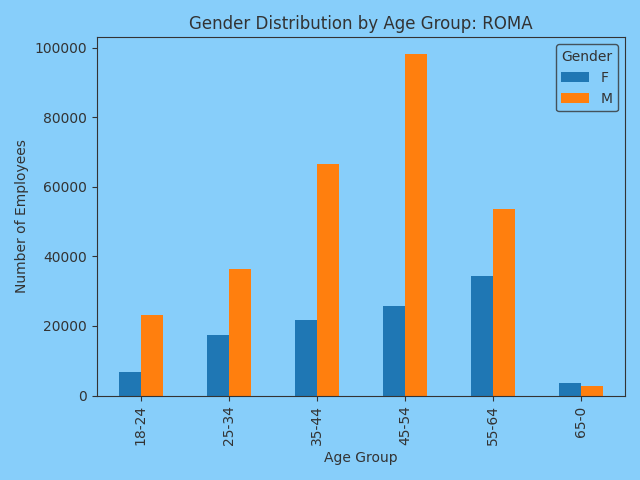
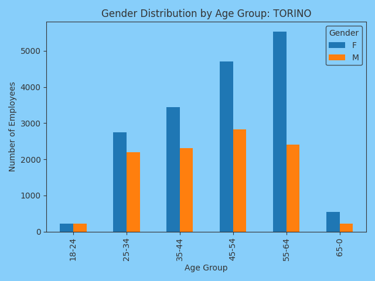


5. **Determines if there is a correlation between the method of portal access (from EntryAccessAdministration) and the average commuting distance (from EntryPendularity) for each administration**
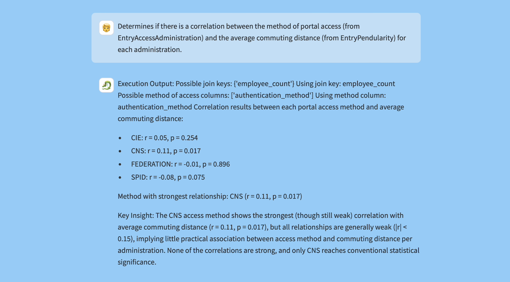


## Section 5 - Conclusion

This project demonstrates the feasibility and value of using function-aware LLM agents for structured data analysis. By combining semantic understanding, code generation, memory, and visualization in a unified pipeline, we built a flexible, efficient, and user-friendly interface for civic analytics.
The architecture can be extended beyond public administration, to education, healthcare, or sustainability domains where structured data and unstructured queries must be reconciled.


