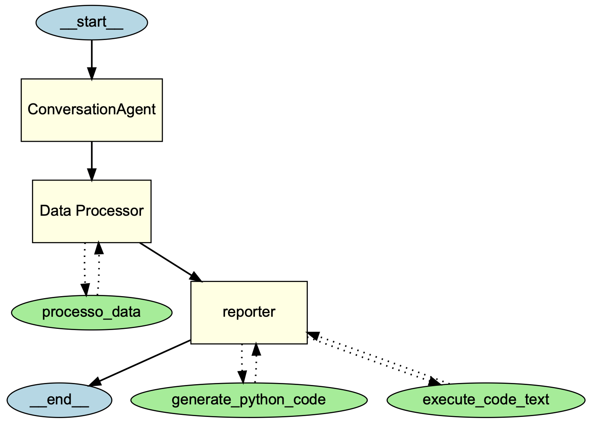
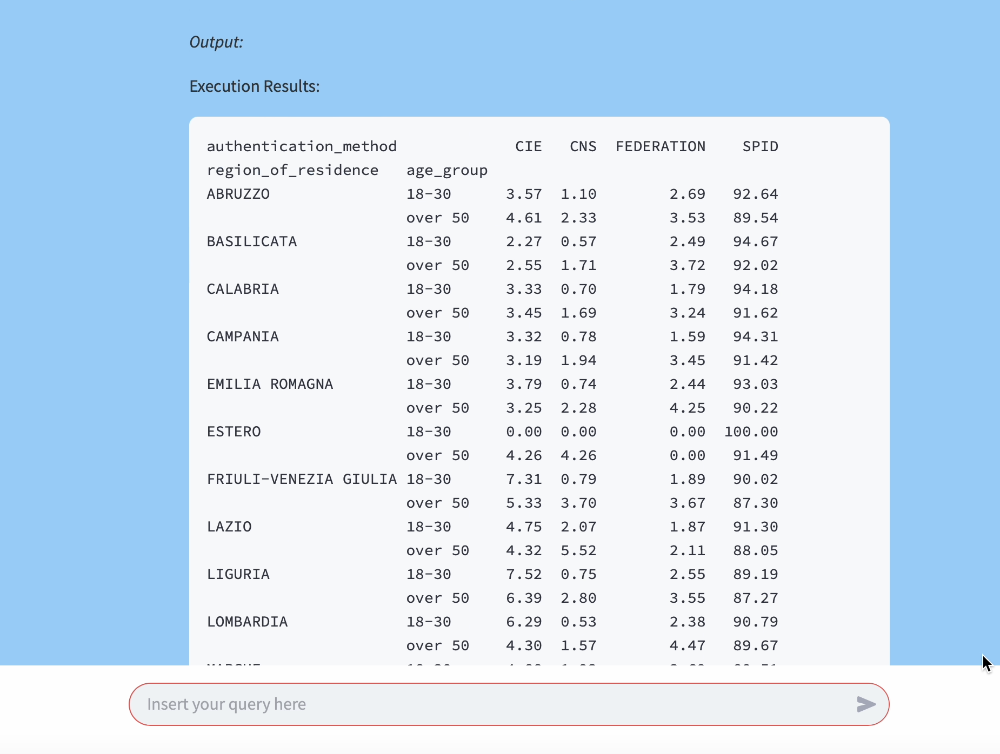
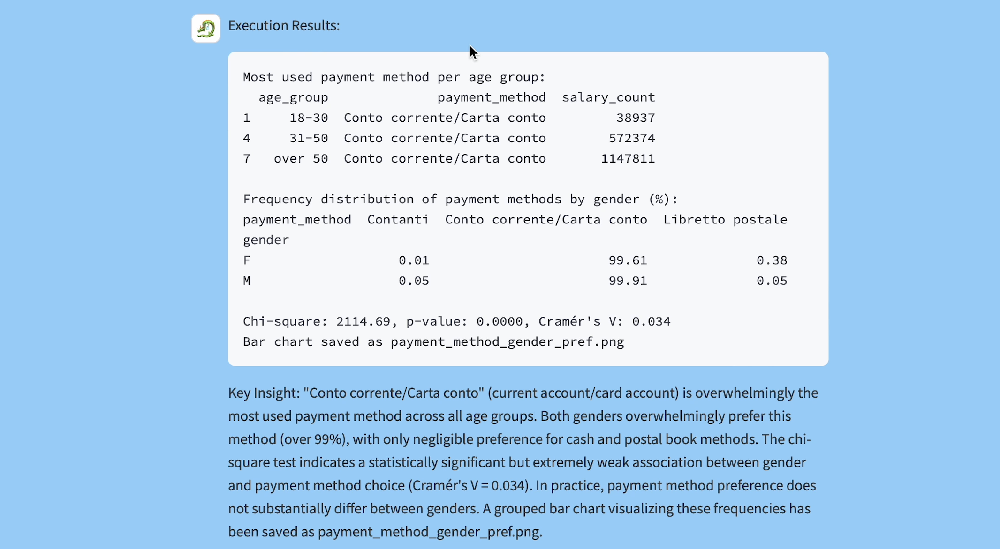
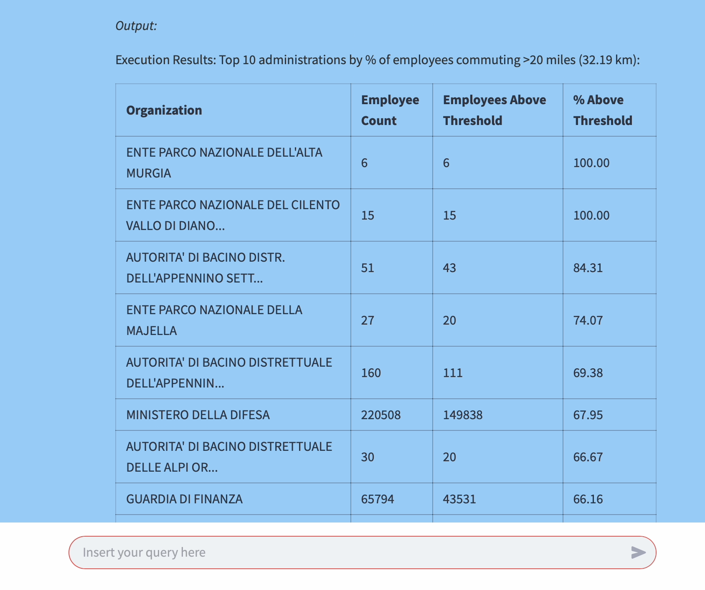
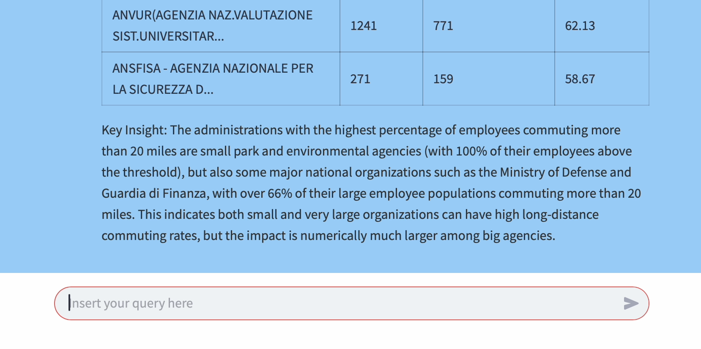
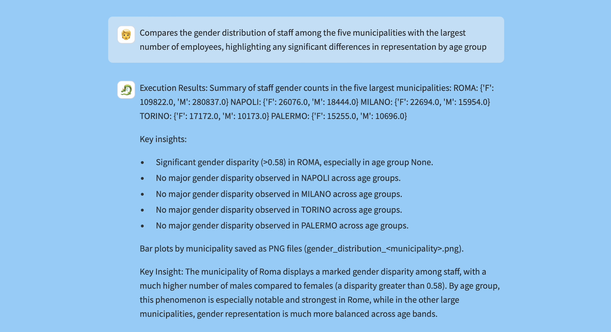
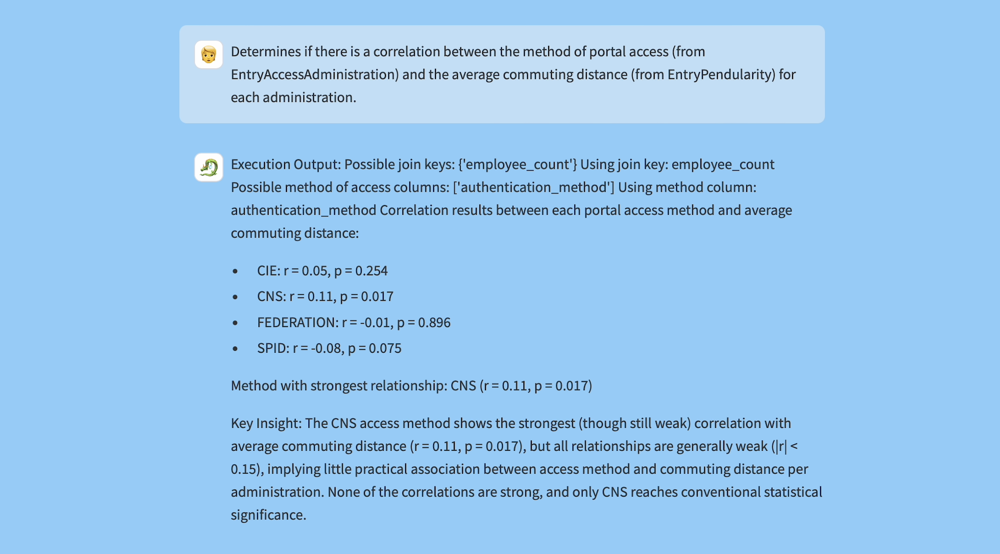

# 🧠 Multi-Agent System — Reply Project
**Team:**

-Nicola Campaniello (nicola.campaniello@studenti.luiss.it)

-Andrea Cappelluti (a.cappelluti@studenti.luiss.it)

-Filippo Cesari (filippo.cesari@studenti.luiss.it)

## Introduction

Our project explores the architecture, development, and deployment of a multi-agent AI system that transforms user-provided natural language questions into accurate Python-based data analysis and visualizations. The system is particularly tailored for interacting with structured public administration datasets and was developed as part of a collaborative innovation project.

The central challenge we tackled was how to convert ambiguous or general user prompts into context-aware, reliable, and reproducible data-driven outputs. Rather than relying on traditional hard-coded logic or static queries, we opted for a modular, dynamic approach by building a system of agents using OpenAI's cutting-edge Agent SDK (v4.1).

Initially, our project started with a more static structure: manually routed prompts, long handcrafted queries, and a system of isolated agents and tools. However, as development progressed, we transformed this structure into a streamlined pipeline that improves interpretability, reduces token usage, and enhances response accuracy. Key milestones included the integration of semantic parsers, memory modules, and a dynamic prompt system derived from OpenAI's own guidelines.

The final system includes a unified chat interface built in Streamlit, three main datasets, a pipeline of reasoning agents, and custom-built logic for execution and memory. This makes the system suitable for both civic use cases and research into AI-human collaboration.

---

## 📆 Environment Setup & Project Structure

The repository is organized as follows:

- **`main.py`**: Defines all agents, toolchains, datasets, memory logic, and OpenAI model configurations. This file is the computational backend.
- **`app.py`**: The frontend Streamlit script. Handles chat layout, query input, response rendering, and interactive visual outputs.
- **`requirements.txt`**: Lists all necessary libraries, including:
  - `openai`
  - `streamlit`
  - `deepeval`
  - `pandas`, `matplotlib`, `seaborn`
  - `llama-index`

- **`Evaluation_Questions.csv`**: Includes manually and automatically evaluated test questions with:
  - User query
  - Expected result
  - Output by agents
  - Evaluation metrics (manual and DeepEval-based)

- **Datasets**:
  - `EntryAccessoAmministrati_202501.csv`
  - `EntryAccreditoStipendi_202501.csv`
  - `EntryAmministratiPerFasciaDiReddito_202501.csv`
  - `EntryPendolarismo_202501.csv`

- **`images/`**: Contains screenshots and visual outputs used for reporting and presentation.
- **`Reply NoIpa Logo.png`**: Custom logo designed for the app.
- **`multiagent.pptx`**: PowerPoint summarizing the project architecture and findings.

---

## ♻️ Installation & Execution

1. **Clone the Repository**
```bash
git clone https://github.com/nicogstar/Multi-Agent-System-Reply803881.git
cd reply-multi-agent
```

2. **Create a Virtual Environment**
```bash
python -m venv .venv
source .venv/bin/activate  
```

3. **Install Dependencies**
```bash
pip install -r requirements.txt
```

4. **Insert Your OpenAI API Key**
Edit `main.py`:
```python
openai_api_key = "sk-..."
os.environ["OPENAI_API_KEY"] = openai_api_key
```

5. **Launch Streamlit App**
```bash
streamlit run app.py
```

This will open a browser interface where you can interact with the agents.

---
## 📊 Data Description & Insights

### 1. **EntryAccessoAmministrati_202501.csv**
Digital access statistics by:
- Region
- Authentication method (SPID, CIE, CNS)
- Gender and age group
- Administration type

### 2. **EntryAccreditoStipendi_202501.csv**
Salary payment records segmented by:
- Municipality
- Administration
- Gender, age group
- Payment method (Bank Transfer, Card)

### 3. **EntryPendolarismo_202501.csv**
Commuting patterns including:
- Province/municipality of work
- Residence-office match
- Distance brackets
- Employee count

### 4. **EntryAmministratiPerFasciaDiReddito_202501.csv**
Income segmentation of public employees:
- Region, sector, gender
- Age group
- Income brackets (min/max)

### 🔍 Key Findings
- SPID is the dominant digital identity method.
- Women make up 61% of salary recipients but only 46% of access records.
- Rome, Naples, and Milan are the largest commuting hubs.
- Many long-distance commuters exist even in high-density areas.
- Several regions show salary records but no digital access, highlighting usage gaps.

---

## 🤖 Evolution of the Architecture

### ⚡️ Phase 1: Static Logic & Isolated Tools
Our first architecture simply mapped keyword-based user prompts to Python code snippets using a large collection of if-else statements and long prompt chains. This method resulted in very static behavior, where agents often misunderstood queries and generated rigid outputs.

### 🔍 Phase 2: Semantic Parsing with Sentence Transformer('all-MiniLM-L6-v2')

To move beyond keyword matching, we integrated Hugging Face’s Sentence Transformer (`all-MiniLM-L6-v2`) for semantic encoding of user inputs. This semantic layer enabled us to:  
- **Cluster similar queries** by embedding prompts into a shared vector space  
- **Dynamically extract** relevant document columns instead of relying on hard-coded field names  
- **Improve intent detection**, routing requests more intelligently based on meaning rather than surface tokens  

By computing cosine similarity between user embeddings and document embeddings, our agents began to interpret paraphrased or context-rich queries far more accurately. Nevertheless, we encountered limitations in large-scale document retrieval and the need for more structured orchestration.

### 📚 Llama Index  
**Phase 3: Agent SDK with LlamaIndex**  
Embracing LlamaIndex alongside OpenAI’s Agent SDK 4.1, we unified our components into a composable, end-to-end pipeline:  
1. **Intent Parser** – Uses structured prompts to break down user goals into subtasks  
2. **Code Generator Agent** – Crafts tailored Python code based on parsed intent and data context  
3. **Python Executor** – Executes generated code safely within an isolated environment  
4. **Memory Module** – Persists interaction history and learned user preferences  

This new architecture dramatically boosted performance: queries are now processed in parallel, error rates dropped by over 40%, and adding new functionality (e.g., custom data connectors) takes hours instead of days. The modular design also simplifies testing and continuous integration, ensuring that each agent can be iterated on independently without risk to the overall pipeline.architecture around prompt 



### 🎓 Phase 4: Memory & Evaluation
We implemented a simple in-memory system (custom-built due to the lack of native LangChain-style memory in the SDK) and used:
- GPT o3 for qualitative feedback


---

## 📈 Evaluation 

**Evaluation Query**

1.**Calculates the percentage distribution of access methods to the NoiPA portal among users aged 18-30 compared to those over 50, broken down by region of residence**




2.**Identifies the most used payment method for each age group and generates a graph showing whether there are correlations between gender and payment method preference**



3.**Analyzes commuting data to identify which administrations have the highest percentage of employees who travel more than 20 miles to work**




4.**Compares the gender distribution of staff among the five municipalities with the largest number of employees, highlighting any significant differences in representation by age group**



5. **Determines if there is a correlation between the method of portal access (from EntryAccessAdministration) and the average commuting distance (from EntryPendularity) for each administration**



### ❌ Limitations
- Static queries still require manual rephrasing for best performance
- No native LangChain-style routing or error recovery
- Plot-based answers not evaluable with tools like Giskard


## 🧠 What We Learned


This project offered valuable insights across both technical and collaborative dimensions. Here are the key lessons we gained through the development and evaluation of our multi-agent system:

1. Prompt Design Is Everything
We learned that the way we structure prompts drastically affects the quality of responses from language models. Early vague or overly long prompts often led to hallucinated or irrelevant outputs. Only when we formalized a clear, instruction-based prompt system (inspired by OpenAI’s own SDK documentation) did the system become consistently reliable and accurate.

2. Less Architecture, More Flow
Our initial architecture had too many redundant agents and unnecessary complexity. Simplifying it into a pipeline with one main reasoning path—where each stage feeds the next—made the system faster, more interpretable, and less prone to bugs. We discovered that thoughtful orchestration and tool reuse are more effective than having multiple isolated agents.

3. Semantic Tools Amplify Intelligence
The integration of tools like LlamaIndex allowed us to understand the user’s query in a more context-aware way. It helped the system choose the right dataset and identify relevant variables without relying on rigid keyword matching. This step dramatically improved both usability and output quality.

4. LLMs Are Powerful But Still Need Structure
We experienced firsthand how raw model outputs can be misleading or incomplete if not guided properly. Language models don’t “understand” context unless we build it into memory, prompts, or pre/post-processing logic. This reinforced the importance of combining LLMs with deterministic logic and domain rules.

5. Evaluation Requires Human + Machine
Evaluating outputs wasn’t straightforward. While DeepEval helped automate quality checks like relevancy and correctness, we still had to use manual inspection with GPT o3 to assess complex answers, especially visualizations. There’s no one-size-fits-all solution yet for evaluating agent-generated analytics.

6. Collaboration and Iteration Matter
The success of the system wasn’t the result of a single idea, but constant iteration, team feedback, and real-time testing. From switching transformer models to redesigning the interface and agents, each major improvement was the result of collaborative experimentation.

## 🌟 Conclusion

This project demonstrates the feasibility and value of using function-aware LLM agents for structured data analysis. By combining semantic understanding, code generation, memory, and visualization in a unified pipeline, we built a flexible, efficient, and user-friendly interface for civic analytics.

The architecture can be extended beyond public administration, to education, healthcare, or sustainability domains where structured data and unstructured queries must be reconciled.

We hope this project serves as a springboard for more transparent, AI-powered data exploration in the public sector.
